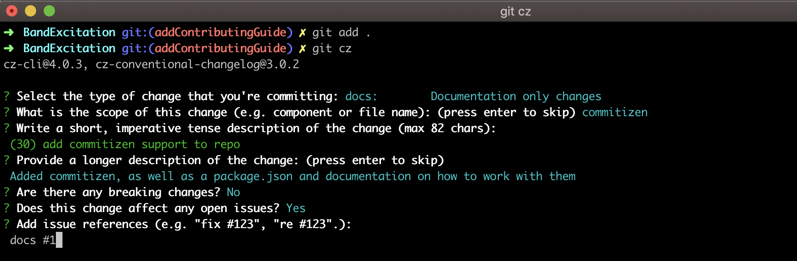
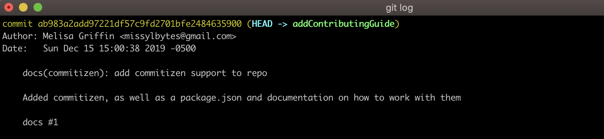

# Contribution guide

## Developing ExcitationTool

Thanks for wanting to contribute to the SmartLabGaTech BandExcitation Tool!

Please follow the Rules below when creating a Pull-Request:

## Requirements for Development
- [Python](https://www.python.org/)
- [Commitizen](http://commitizen.github.io/cz-cli/)
- [Conventional Changelog](https://github.com/conventional-changelog/conventional-changelog/tree/master/packages/conventional-changelog-cli)
### Commitizen example
When making your commits, run `git cz`. You will then be prompted to scope your commit correctly. Make sure you also put the correct issue number into the commit.

This allows the commit messages to look like this:

### Rebasing
Always be sure to rebase with Master
After rebasing, make sure you run `npm run changelog` from the root level.
## Coming Soon: CI/CD